# Djngo Book Shelf Project
This is  a django project that shelfs books

This shelf can allow admin users perform the following operationns
 * Adding new books
 * Archiving stolen or lost books
 * Delete books

This project was done using [Python Programming Language](https://www.python.org) and the [Django Web FrameWork](https://www.djangoproject.com)

----------------------------------

## Here are the steps in Running the project.
1. Start your code editor preferably visual studio code
2. Open the folder that contains the bookshelf project after ypu have cloned it
3. Intalll the crispy forms library
4. Next run `python manage.py migrate` to migrate all models to the database schema
5. Next run  `python manage.py makemigrations`, this will automatically make migrations for all the app present in the project folder
6. Next run `python manage.py migrate` again to finally move all migrations
7. Finally you can run the python server using `python manage.py runserver` you can decide to add your desired port number e.g `python manage.py runserver 5000`. This is how we run teh server if we wanted to use port 50000
8. Our server should be up and running
-----------------------
### Creating our SuperUser
1. Quit the server by using the keyboard interrupt `CTRL + C`
2. Run the create superuser command using `python manage.py createsuperuser`
3. This will prompt us for our details such as username, email address, password and password agai which is to validate our password
  * `Enter Username(hit enter to use the default omputer name)`
  * `Email Address` hit enter to leave blank
  *  `Enter password` and 
  *  `Enter password (again)` 
  *  With this few steps our superuser has been created
4. Re-run the server again
----------------------------------------
## Operating the Book Shelf Project
> After we run our Python server running on `port 8000`
> The default page takes us to the index page which is the `book_list.html` page 

* The booklist page is like this 
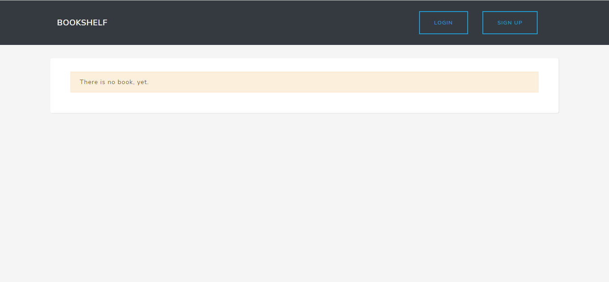

* Next we login our superuser
 

* After logging in as super user we'll be redirected to the homepage which contains no book, let us add new books,
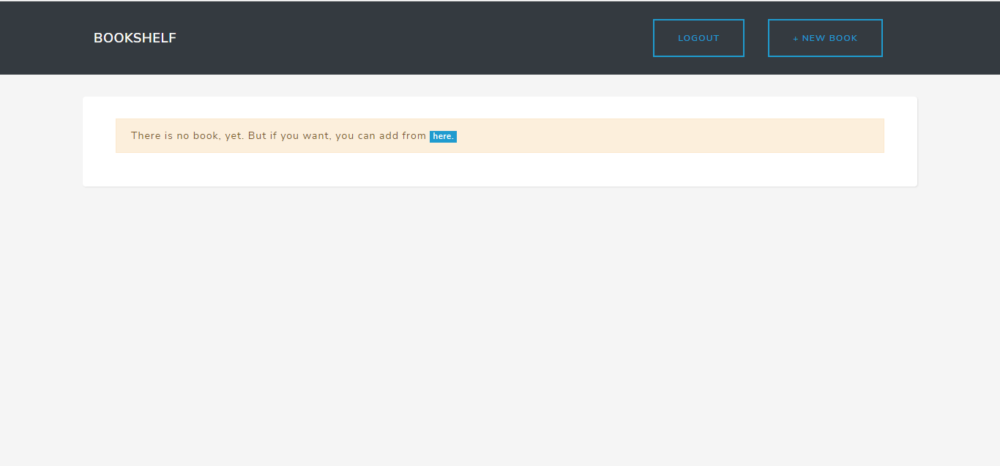

* Our add a new book page looks like this
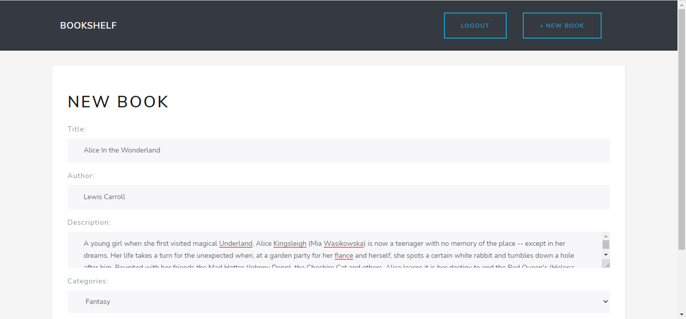

After adding some images we'll have these view
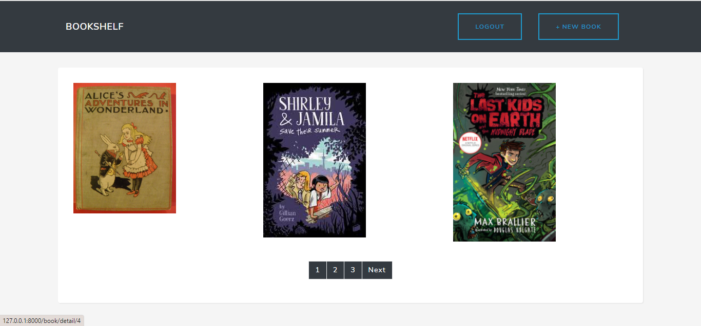
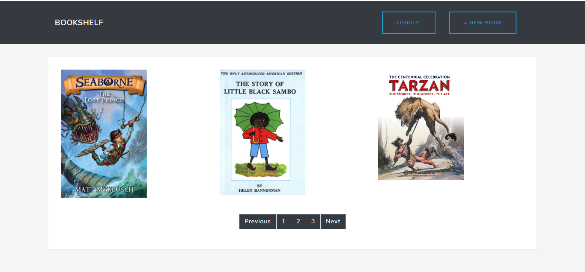
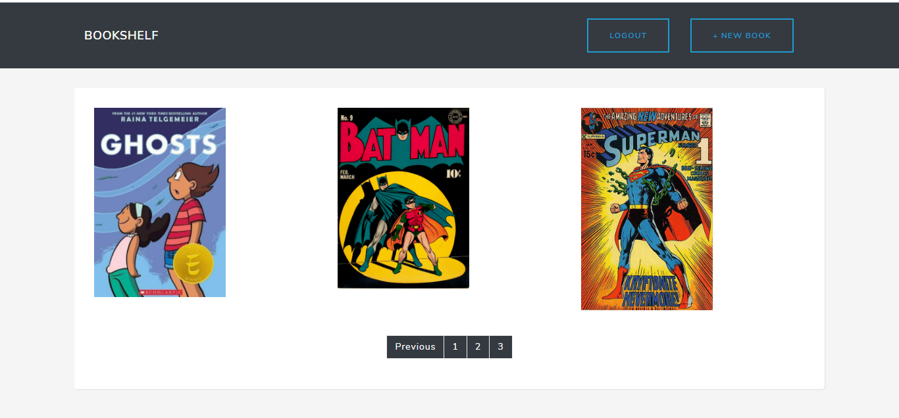

* Checking the details of what we have built looks like this 
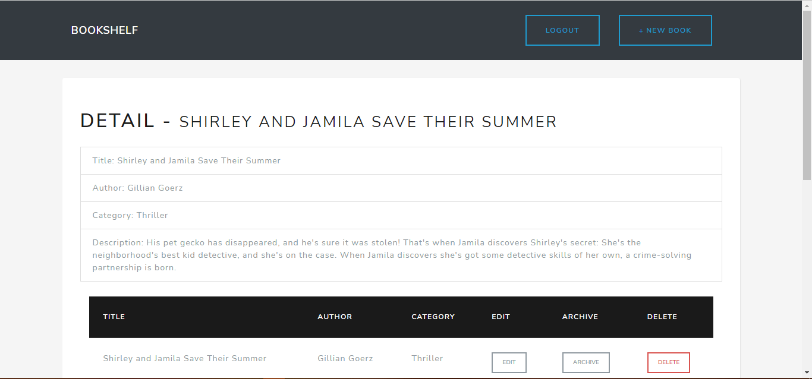
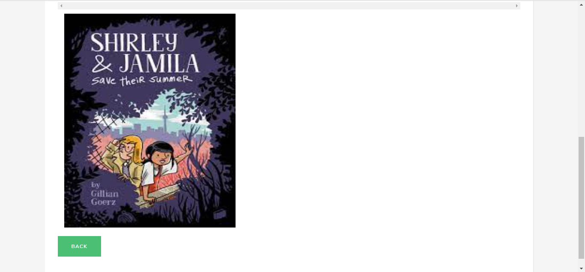

* Editing the the books have the following look 
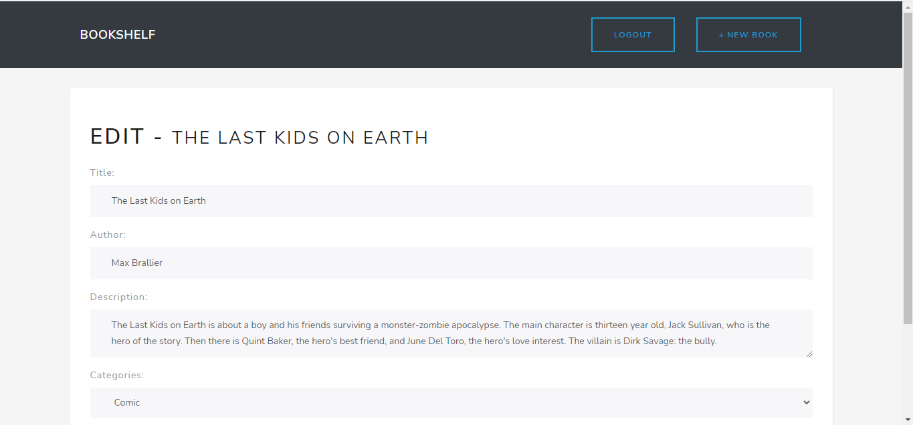
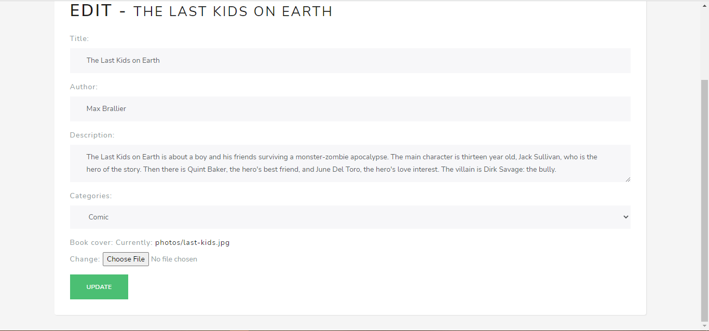

* Archiving the book looks like

* Deleting a book looks like 
*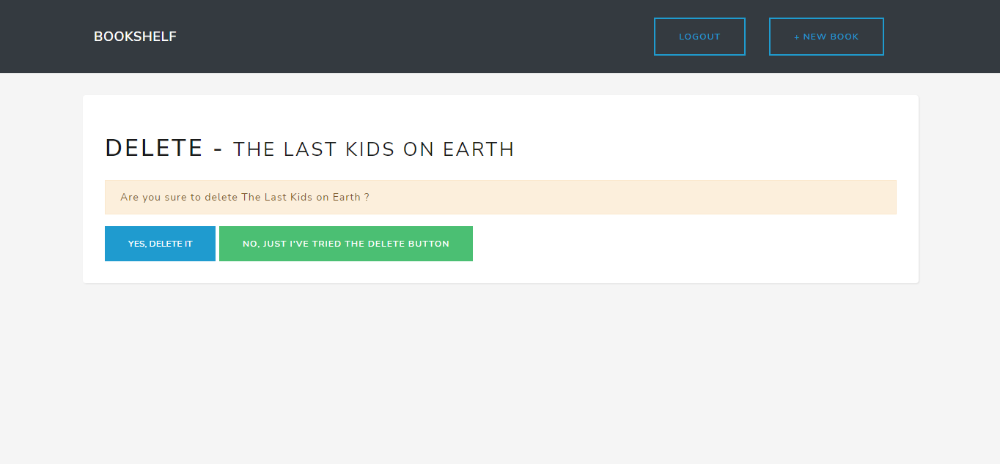

* Logging Out looks like 
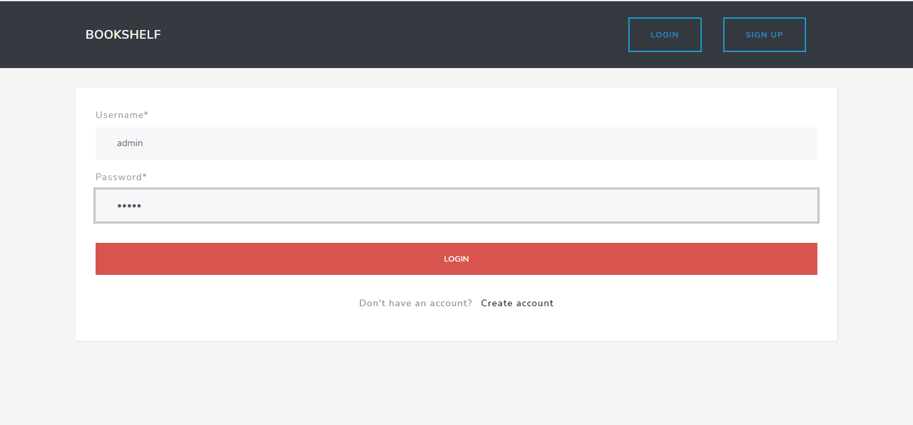

* Registering another user whi is not a superuser and viewing the details of each book. Meanwhile for every other view operations is not functional because he/she is not admin

* Active user sign up
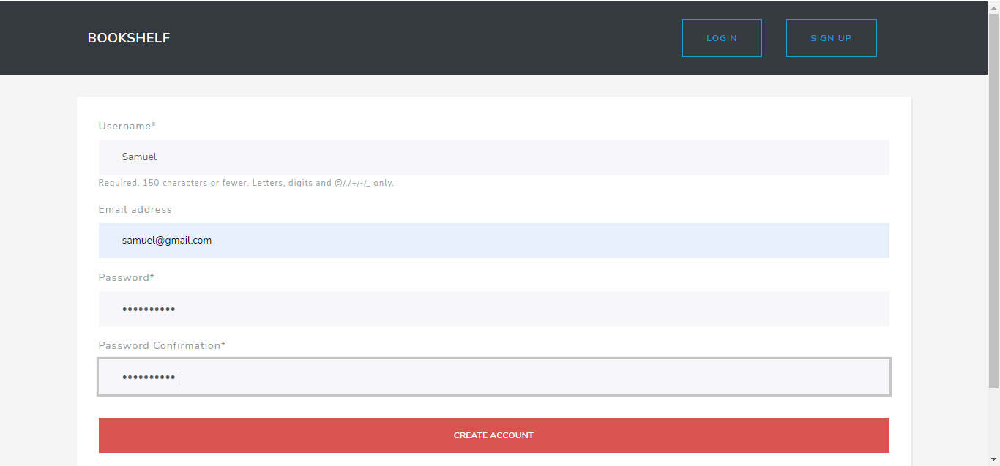
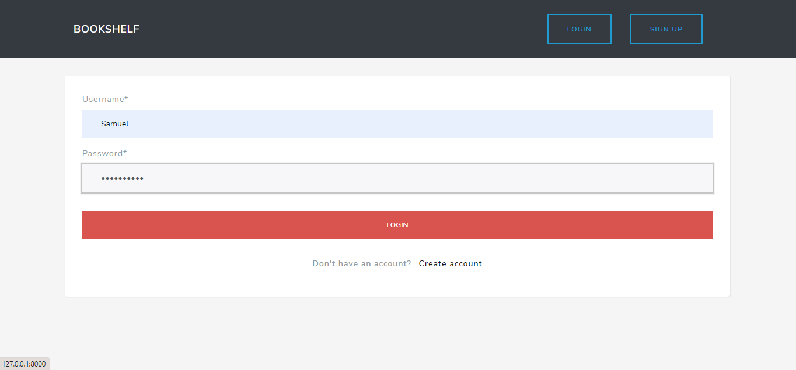
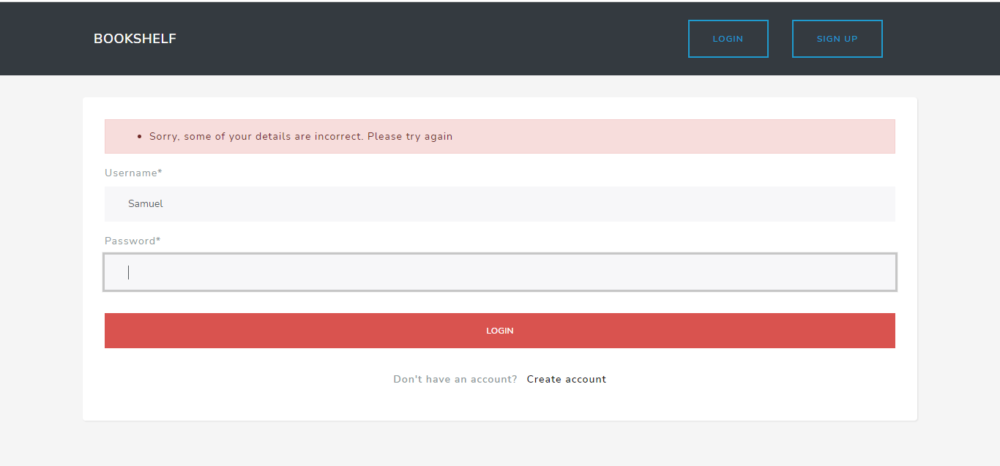
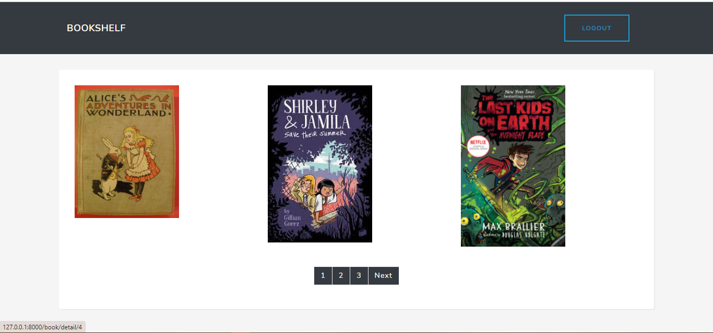
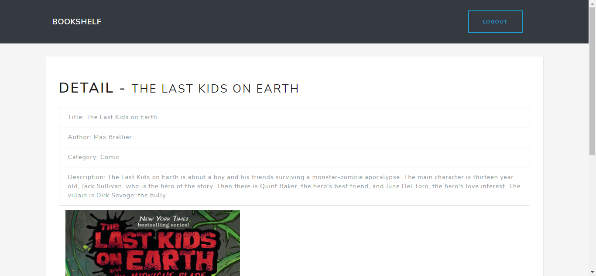
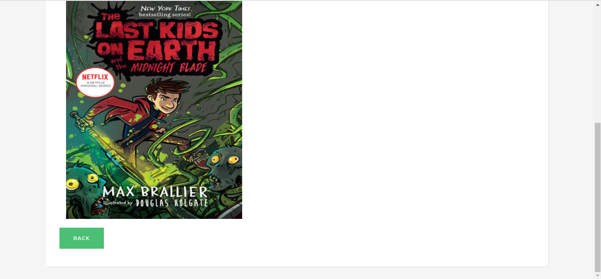

